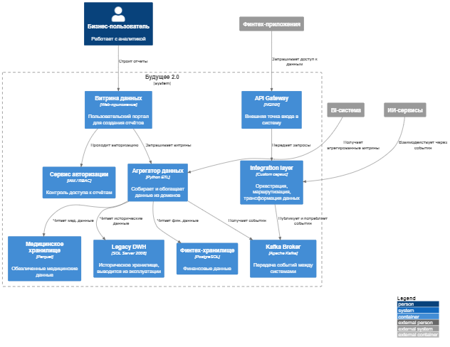
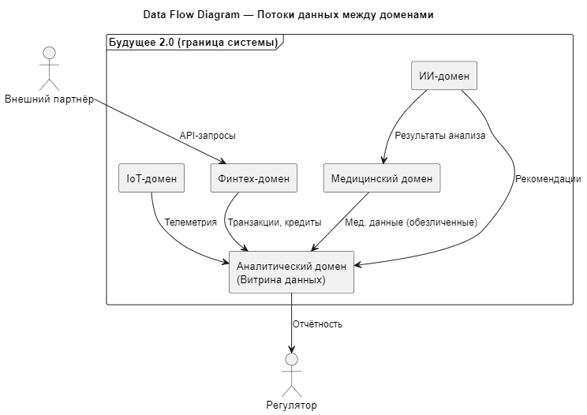
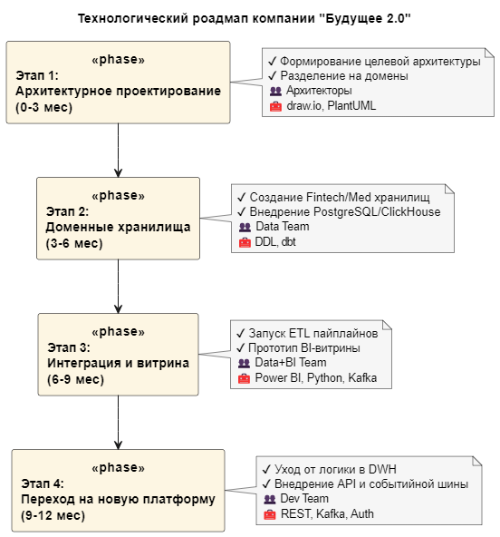

# 📦 Архитектура ПО — Проект: Будущее 2.0

## 🏢 О компании «Будущее 2.0»

Компания начинала как медицинский стартап, а сегодня представляет собой мультибизнес-экосистему, включающую:
- 🏥 Медицинские услуги
- 🤖 ИИ-сервисы для диагностики
- 💳 Финтех с собственной банковской лицензией
- ⚙ Производство медоборудования

## 🎯 Постановка задачи

Компания столкнулась с проблемами монолитной архитектуры:
- Сложность масштабирования DWH
- Устаревшие технологии (Power Builder, SQL Server 2008)
- Долгая генерация отчётов
- Необходимость гибко развивать новые направления бизнеса

**Цель проекта:**
- Построить масштабируемую архитектуру, ориентированную на домены
- Создать витрину данных и модернизировать ИТ-ландшафт
- Разделить систему на независимые бизнес-направления
- Уйти от монолитной логики в DWH

---

## ✅ Задание 1: Архитектура через год

**Что сделано:**
- Разработана C4-диаграмма (уровень контейнеров)
- Выявлены и описаны проблемные места
- Выполнена приоритизация по методу MoSCoW

### 🔍 Пояснительная записка к C4-диаграмме: роль Integration Layer и отказ от DWH

Архитектура в C4-модели построена на принципах слабосвязанной доменной интеграции, и ключевую роль в этом играет `Integration Layer`:

#### 🧱 Integration Layer — основной элемент замены DWH:
- Это отдельный модуль/сервис, который выполняет функции интеграционной шины без использования тяжёлых ESB.
- Он принимает запросы через API Gateway и события из Kafka, обрабатывает их (трансформация, маршрутизация) и направляет в нужный домен или агрегатор.

📌 Благодаря этому:
- Новые бизнесы (например, фармацевтика, заводы, логистика) можно включать в архитектуру через Kafka или API, **не изменяя бизнес-логику в DWH**.
- Он становится точкой интеграции между новыми системами и аналитической платформой.

#### 🔄 Почему это заменяет логику в DWH:

| В DWH раньше                        | Теперь в Integration Layer / Aggregator           |
|------------------------------------|---------------------------------------------------|
| SQL-процедуры с бизнес-логикой     | Преобразования в коде (Python, dbt, Kafka-процессы) |
| Сложные зависимости таблиц         | Явные API-контракты между сервисами              |
| Централизованный расчёт показателей| Распределённая обработка и агрегация данных      |

#### 🔧 Связанные компоненты:

- `Kafka Broker` — транспортный уровень для событий, обеспечивает масштабируемую и гибкую передачу данных между системами.
- `Data Aggregator (через Kafka)` — потребляет события от разных доменов и формирует аналитические витрины.
- `Legacy DWH (доступен через Data Aggregator)` — временный источник исторических данных, задействуется в процессе агрегации, но не подключён напрямую к интеграционному слою.

**Файлы:**
- [`C4.puml`](Task1/C4.puml)
- [`problems_architecture.md`](Task1/problems_architecture.md)
- [`problems_moscow_prioritization.md`](Task1/problems_moscow_prioritization.md)
## ✅ Задание 2: Домены и потоки данных

**Что сделано:**
- Система разделена на независимые домены
- Разработана Data Flow Diagram
- Приведена аргументация преимуществ такого подхода

**Файлы:**
- [`domain_model.md`](Task2/domain_model.md)
- [`data_flow_diagram.puml`](Task2/data_flow_diagram.puml)
- [`domain_justification.md`](Task2/domain_justification.md)

---

## ✅ Задание 3: Техрадар и роадмап

**Что сделано:**
- Сформирован технический радар (ADOPT, TRIAL, ASSESS, HOLD)
- Разработан технологический роадмап (в Draw.io и PlantUML)
- Подготовлено обоснование этапов трансформации

**Файлы:**
- [`tech_radar.md`](Task3/tech_radar.md)
- [`tech_roadmap.puml`](Task3/tech_roadmap.puml)
- [`roadmap_justification.md`](Task3/roadmap_justification.md)

---

## 📌 Итог

Предложенное решение обеспечивает:
- Независимое развитие бизнес-направлений
- Снижение зависимости от легаси
- Повышение гибкости и прозрачности архитектуры
- Оптимизацию бизнес-отчётности
